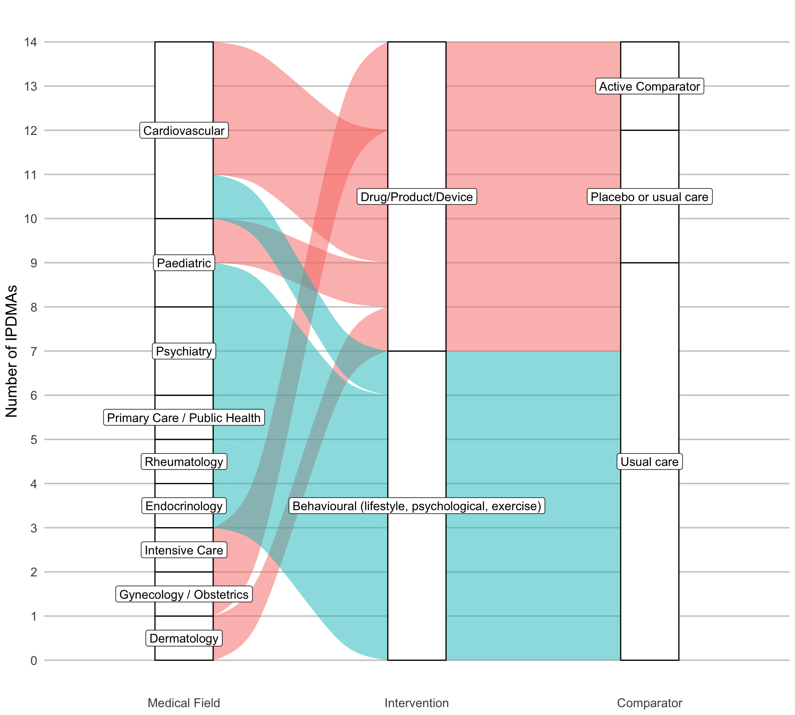
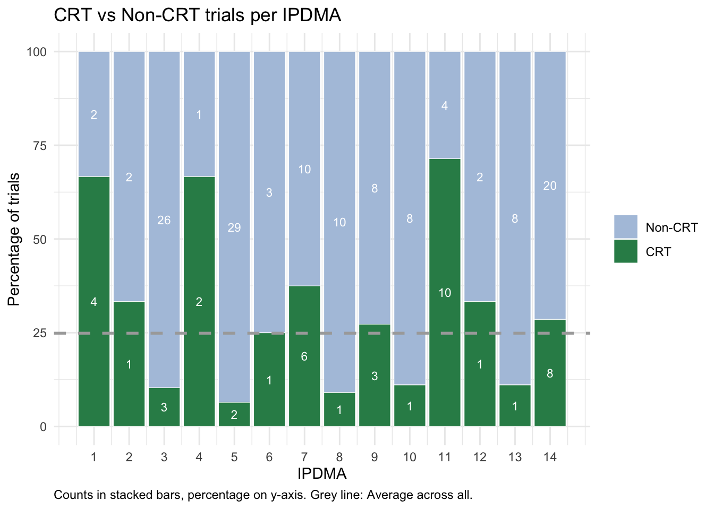
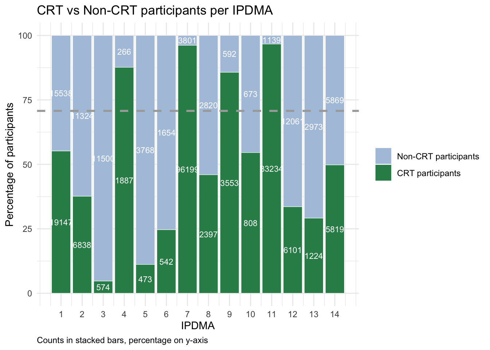
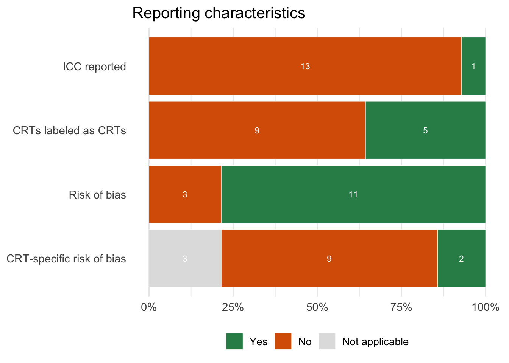
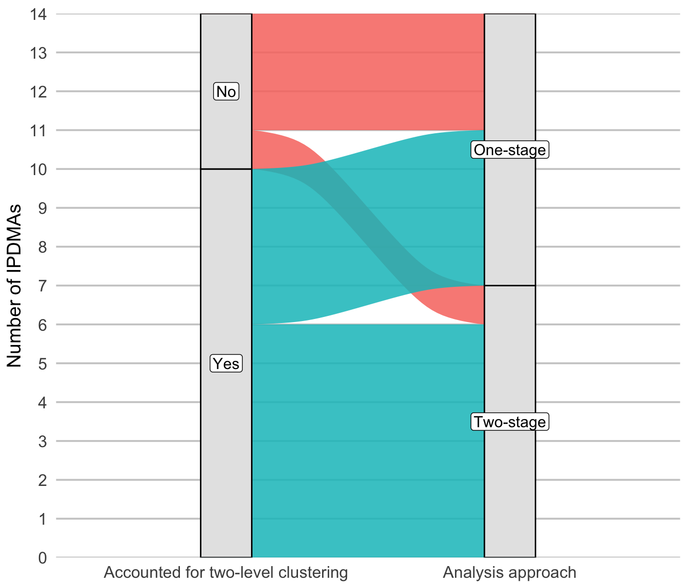
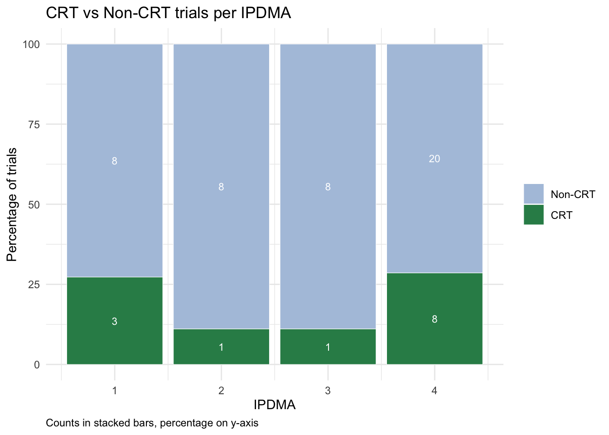
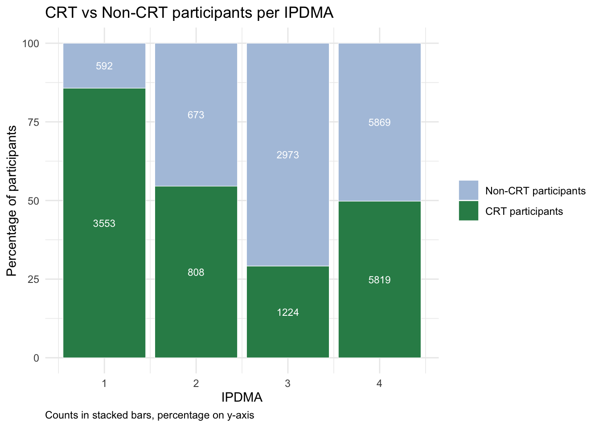

*! Preliminary data & results ! 10.11.2025*

**Packages**


::: {.cell}

```{.r .cell-code}
req_pkgs <- c("readxl",
              "tidyverse",
              "here",
              "ggplot2",
              "ggalluvial", # sankey
              "gtsummary",
              "forcats", # ordering function
              "scales" # likert plot
)
install_if_missing <- function(pkgs){
  for(p in pkgs){
    if(!requireNamespace(p, quietly=TRUE)){
      install.packages(p, repos="https://cloud.r-project.org")
    }
    library(p, character.only=TRUE)
  }
}
install_if_missing(req_pkgs)
```
:::


# **(1) Dataset formatting**


::: {.cell}

```{.r .cell-code}
# Import
df <- read_excel(here("IPDMA_CRT_extraction_10112025.xlsx"))

df$`State Of Play Covidence #` <- as.factor(df$`State Of Play Covidence #`)
    
# Recode the comparator group description levels
df <- df %>%
  mutate(
    `Comparator category` = case_when(
      str_detect(`Describe Comparator`, regex("placebo", ignore_case = TRUE)) ~ "Placebo or usual care",
      `Describe Comparator` %in% c("iron and folic acid supplements only", "Saline") ~ "Active Comparator",
      TRUE ~ "Usual care"
    )
  )

# Recode the intervention group description levels
df <- df %>%
  mutate(
    `Intervention category` = case_when(
      `Intervention category` == "Behavioural" ~ "Behavioural (lifestyle, psychological, exercise)",
      `Intervention category` == "Rehabilitation" ~ "Behavioural (lifestyle, psychological, exercise)",
      TRUE ~ `Intervention category`
    )
  )

# Rename the medical field level
df <- df %>%
  mutate(
    `Medical field` = case_when(
      `Medical field` == "Cardiovascular/Cardiac" ~ "Cardiovascular",
      TRUE ~ `Medical field`
    )
  )

# Rename variables
df <- df %>%
  rename(
    `ICC reported` = `ICC or any other measure of between-cluster variability for at least one of the pooled outcomes (incuding CRTs) reported`,
    `CRTs labeled as CRTs` = `CRTs flagged as CRT in ‘Characteristics of included studies’ table`,
    `Analysis framework` = `Analysis framework for the main IPDMA analysis`,
    `Analysis approach` = `Main IPDMA analysis approach`,
    `Treatment effect model` = `Main IPDMA analysis model regarding treatment effect`,
    `Accounted for two-level clustering` = `Do the authors account for the two-level clustering, i.e., CRT-level (clusters within CRT(s)) and IPDMA-level (pooling of trials)?`,
    `CRT-level estimator` = `If two-stage, what estimator do the authors use to account for clustering at the CRT-level`,
    `Small sample correction` = `Do the authors report any correction in case of low cluster number in any of the involved CRTs (\"small sample correction\")?`,
    `CRT vs IRT analysis` = `Any subgroup analysis/meta-regression performed based on study design (CRTs vs individual RCTs)?`,
    `Covariate adjustment` = `Any covariate adjustment applied for the main analysis?`,
    `Risk of bias` = `Any risk of bias assessment done?`,
    `CRT-specific risk of bias` = `If RoB done, any CRT-specific risk of biases assessed?`,
  )

# Recode the CRT-specific risk of bias variable by explicitly showing Unknown
df <- df %>%
  mutate(
    `CRT-specific risk of bias` = case_when(
      is.na(`CRT-specific risk of bias`) ~ "Not applicable",
      TRUE ~ `CRT-specific risk of bias`))

# Create long dataset to work with CRT/IPDMA format
df_long <- df %>%
  pivot_longer(
    cols = matches("^CRT[0-9]+:"),
    names_to = c("CRT", ".value"),
    names_pattern = "(CRT[0-9]+): (.*)"
  )
df_long <- df_long %>%
  filter(!is.na(`name/ID`))

# Rename the consent variable
df_long <- df_long %>%
  mutate(
    `Consent procedure` = case_when(
      `Consent procedure` == "Passive consent (Participation occurs unless they actively refuse “opt-out”)" ~ "Passive consent",
      `Consent procedure` == "Waiver of consent (No consent sought/communicated to participants)" ~ "Waiver of consent",
      `Consent procedure` == "Active consent (Participant must explicitly agree “opt-in”)" ~ "Active consent",
      TRUE ~ `Consent procedure`
    )
  )
```
:::


# **(2) Baseline table**


::: {.cell}

```{.r .cell-code}
baseline_vars <- c(
  # "Location of corresponding author",
  # "Cochrane review?",
  "Medical field",
  "Intervention category",
  "Comparator category"
)

baseline_table <-
  df %>%
  select(all_of(baseline_vars)) %>%
  mutate(across(
    everything(),
    ~ fct_infreq(factor(.))
  )) %>%
  tbl_summary(
    missing = "ifany",
    type = all_categorical() ~ "categorical",
    statistic = all_categorical() ~ "{n} ({p}%)"
  ) %>%
  modify_header(label = "**IPDMA Characteristics**") %>%
  bold_labels()

baseline_table
```

::: {.cell-output-display}

```{=html}
<div id="smyrjqsjnr" style="padding-left:0px;padding-right:0px;padding-top:10px;padding-bottom:10px;overflow-x:auto;overflow-y:auto;width:auto;height:auto;">
<style>#smyrjqsjnr table {
  font-family: system-ui, 'Segoe UI', Roboto, Helvetica, Arial, sans-serif, 'Apple Color Emoji', 'Segoe UI Emoji', 'Segoe UI Symbol', 'Noto Color Emoji';
  -webkit-font-smoothing: antialiased;
  -moz-osx-font-smoothing: grayscale;
}

#smyrjqsjnr thead, #smyrjqsjnr tbody, #smyrjqsjnr tfoot, #smyrjqsjnr tr, #smyrjqsjnr td, #smyrjqsjnr th {
  border-style: none;
}

#smyrjqsjnr p {
  margin: 0;
  padding: 0;
}

#smyrjqsjnr .gt_table {
  display: table;
  border-collapse: collapse;
  line-height: normal;
  margin-left: auto;
  margin-right: auto;
  color: #333333;
  font-size: 16px;
  font-weight: normal;
  font-style: normal;
  background-color: #FFFFFF;
  width: auto;
  border-top-style: solid;
  border-top-width: 2px;
  border-top-color: #A8A8A8;
  border-right-style: none;
  border-right-width: 2px;
  border-right-color: #D3D3D3;
  border-bottom-style: solid;
  border-bottom-width: 2px;
  border-bottom-color: #A8A8A8;
  border-left-style: none;
  border-left-width: 2px;
  border-left-color: #D3D3D3;
}

#smyrjqsjnr .gt_caption {
  padding-top: 4px;
  padding-bottom: 4px;
}

#smyrjqsjnr .gt_title {
  color: #333333;
  font-size: 125%;
  font-weight: initial;
  padding-top: 4px;
  padding-bottom: 4px;
  padding-left: 5px;
  padding-right: 5px;
  border-bottom-color: #FFFFFF;
  border-bottom-width: 0;
}

#smyrjqsjnr .gt_subtitle {
  color: #333333;
  font-size: 85%;
  font-weight: initial;
  padding-top: 3px;
  padding-bottom: 5px;
  padding-left: 5px;
  padding-right: 5px;
  border-top-color: #FFFFFF;
  border-top-width: 0;
}

#smyrjqsjnr .gt_heading {
  background-color: #FFFFFF;
  text-align: center;
  border-bottom-color: #FFFFFF;
  border-left-style: none;
  border-left-width: 1px;
  border-left-color: #D3D3D3;
  border-right-style: none;
  border-right-width: 1px;
  border-right-color: #D3D3D3;
}

#smyrjqsjnr .gt_bottom_border {
  border-bottom-style: solid;
  border-bottom-width: 2px;
  border-bottom-color: #D3D3D3;
}

#smyrjqsjnr .gt_col_headings {
  border-top-style: solid;
  border-top-width: 2px;
  border-top-color: #D3D3D3;
  border-bottom-style: solid;
  border-bottom-width: 2px;
  border-bottom-color: #D3D3D3;
  border-left-style: none;
  border-left-width: 1px;
  border-left-color: #D3D3D3;
  border-right-style: none;
  border-right-width: 1px;
  border-right-color: #D3D3D3;
}

#smyrjqsjnr .gt_col_heading {
  color: #333333;
  background-color: #FFFFFF;
  font-size: 100%;
  font-weight: normal;
  text-transform: inherit;
  border-left-style: none;
  border-left-width: 1px;
  border-left-color: #D3D3D3;
  border-right-style: none;
  border-right-width: 1px;
  border-right-color: #D3D3D3;
  vertical-align: bottom;
  padding-top: 5px;
  padding-bottom: 6px;
  padding-left: 5px;
  padding-right: 5px;
  overflow-x: hidden;
}

#smyrjqsjnr .gt_column_spanner_outer {
  color: #333333;
  background-color: #FFFFFF;
  font-size: 100%;
  font-weight: normal;
  text-transform: inherit;
  padding-top: 0;
  padding-bottom: 0;
  padding-left: 4px;
  padding-right: 4px;
}

#smyrjqsjnr .gt_column_spanner_outer:first-child {
  padding-left: 0;
}

#smyrjqsjnr .gt_column_spanner_outer:last-child {
  padding-right: 0;
}

#smyrjqsjnr .gt_column_spanner {
  border-bottom-style: solid;
  border-bottom-width: 2px;
  border-bottom-color: #D3D3D3;
  vertical-align: bottom;
  padding-top: 5px;
  padding-bottom: 5px;
  overflow-x: hidden;
  display: inline-block;
  width: 100%;
}

#smyrjqsjnr .gt_spanner_row {
  border-bottom-style: hidden;
}

#smyrjqsjnr .gt_group_heading {
  padding-top: 8px;
  padding-bottom: 8px;
  padding-left: 5px;
  padding-right: 5px;
  color: #333333;
  background-color: #FFFFFF;
  font-size: 100%;
  font-weight: initial;
  text-transform: inherit;
  border-top-style: solid;
  border-top-width: 2px;
  border-top-color: #D3D3D3;
  border-bottom-style: solid;
  border-bottom-width: 2px;
  border-bottom-color: #D3D3D3;
  border-left-style: none;
  border-left-width: 1px;
  border-left-color: #D3D3D3;
  border-right-style: none;
  border-right-width: 1px;
  border-right-color: #D3D3D3;
  vertical-align: middle;
  text-align: left;
}

#smyrjqsjnr .gt_empty_group_heading {
  padding: 0.5px;
  color: #333333;
  background-color: #FFFFFF;
  font-size: 100%;
  font-weight: initial;
  border-top-style: solid;
  border-top-width: 2px;
  border-top-color: #D3D3D3;
  border-bottom-style: solid;
  border-bottom-width: 2px;
  border-bottom-color: #D3D3D3;
  vertical-align: middle;
}

#smyrjqsjnr .gt_from_md > :first-child {
  margin-top: 0;
}

#smyrjqsjnr .gt_from_md > :last-child {
  margin-bottom: 0;
}

#smyrjqsjnr .gt_row {
  padding-top: 8px;
  padding-bottom: 8px;
  padding-left: 5px;
  padding-right: 5px;
  margin: 10px;
  border-top-style: solid;
  border-top-width: 1px;
  border-top-color: #D3D3D3;
  border-left-style: none;
  border-left-width: 1px;
  border-left-color: #D3D3D3;
  border-right-style: none;
  border-right-width: 1px;
  border-right-color: #D3D3D3;
  vertical-align: middle;
  overflow-x: hidden;
}

#smyrjqsjnr .gt_stub {
  color: #333333;
  background-color: #FFFFFF;
  font-size: 100%;
  font-weight: initial;
  text-transform: inherit;
  border-right-style: solid;
  border-right-width: 2px;
  border-right-color: #D3D3D3;
  padding-left: 5px;
  padding-right: 5px;
}

#smyrjqsjnr .gt_stub_row_group {
  color: #333333;
  background-color: #FFFFFF;
  font-size: 100%;
  font-weight: initial;
  text-transform: inherit;
  border-right-style: solid;
  border-right-width: 2px;
  border-right-color: #D3D3D3;
  padding-left: 5px;
  padding-right: 5px;
  vertical-align: top;
}

#smyrjqsjnr .gt_row_group_first td {
  border-top-width: 2px;
}

#smyrjqsjnr .gt_row_group_first th {
  border-top-width: 2px;
}

#smyrjqsjnr .gt_summary_row {
  color: #333333;
  background-color: #FFFFFF;
  text-transform: inherit;
  padding-top: 8px;
  padding-bottom: 8px;
  padding-left: 5px;
  padding-right: 5px;
}

#smyrjqsjnr .gt_first_summary_row {
  border-top-style: solid;
  border-top-color: #D3D3D3;
}

#smyrjqsjnr .gt_first_summary_row.thick {
  border-top-width: 2px;
}

#smyrjqsjnr .gt_last_summary_row {
  padding-top: 8px;
  padding-bottom: 8px;
  padding-left: 5px;
  padding-right: 5px;
  border-bottom-style: solid;
  border-bottom-width: 2px;
  border-bottom-color: #D3D3D3;
}

#smyrjqsjnr .gt_grand_summary_row {
  color: #333333;
  background-color: #FFFFFF;
  text-transform: inherit;
  padding-top: 8px;
  padding-bottom: 8px;
  padding-left: 5px;
  padding-right: 5px;
}

#smyrjqsjnr .gt_first_grand_summary_row {
  padding-top: 8px;
  padding-bottom: 8px;
  padding-left: 5px;
  padding-right: 5px;
  border-top-style: double;
  border-top-width: 6px;
  border-top-color: #D3D3D3;
}

#smyrjqsjnr .gt_last_grand_summary_row_top {
  padding-top: 8px;
  padding-bottom: 8px;
  padding-left: 5px;
  padding-right: 5px;
  border-bottom-style: double;
  border-bottom-width: 6px;
  border-bottom-color: #D3D3D3;
}

#smyrjqsjnr .gt_striped {
  background-color: rgba(128, 128, 128, 0.05);
}

#smyrjqsjnr .gt_table_body {
  border-top-style: solid;
  border-top-width: 2px;
  border-top-color: #D3D3D3;
  border-bottom-style: solid;
  border-bottom-width: 2px;
  border-bottom-color: #D3D3D3;
}

#smyrjqsjnr .gt_footnotes {
  color: #333333;
  background-color: #FFFFFF;
  border-bottom-style: none;
  border-bottom-width: 2px;
  border-bottom-color: #D3D3D3;
  border-left-style: none;
  border-left-width: 2px;
  border-left-color: #D3D3D3;
  border-right-style: none;
  border-right-width: 2px;
  border-right-color: #D3D3D3;
}

#smyrjqsjnr .gt_footnote {
  margin: 0px;
  font-size: 90%;
  padding-top: 4px;
  padding-bottom: 4px;
  padding-left: 5px;
  padding-right: 5px;
}

#smyrjqsjnr .gt_sourcenotes {
  color: #333333;
  background-color: #FFFFFF;
  border-bottom-style: none;
  border-bottom-width: 2px;
  border-bottom-color: #D3D3D3;
  border-left-style: none;
  border-left-width: 2px;
  border-left-color: #D3D3D3;
  border-right-style: none;
  border-right-width: 2px;
  border-right-color: #D3D3D3;
}

#smyrjqsjnr .gt_sourcenote {
  font-size: 90%;
  padding-top: 4px;
  padding-bottom: 4px;
  padding-left: 5px;
  padding-right: 5px;
}

#smyrjqsjnr .gt_left {
  text-align: left;
}

#smyrjqsjnr .gt_center {
  text-align: center;
}

#smyrjqsjnr .gt_right {
  text-align: right;
  font-variant-numeric: tabular-nums;
}

#smyrjqsjnr .gt_font_normal {
  font-weight: normal;
}

#smyrjqsjnr .gt_font_bold {
  font-weight: bold;
}

#smyrjqsjnr .gt_font_italic {
  font-style: italic;
}

#smyrjqsjnr .gt_super {
  font-size: 65%;
}

#smyrjqsjnr .gt_footnote_marks {
  font-size: 75%;
  vertical-align: 0.4em;
  position: initial;
}

#smyrjqsjnr .gt_asterisk {
  font-size: 100%;
  vertical-align: 0;
}

#smyrjqsjnr .gt_indent_1 {
  text-indent: 5px;
}

#smyrjqsjnr .gt_indent_2 {
  text-indent: 10px;
}

#smyrjqsjnr .gt_indent_3 {
  text-indent: 15px;
}

#smyrjqsjnr .gt_indent_4 {
  text-indent: 20px;
}

#smyrjqsjnr .gt_indent_5 {
  text-indent: 25px;
}

#smyrjqsjnr .katex-display {
  display: inline-flex !important;
  margin-bottom: 0.75em !important;
}

#smyrjqsjnr div.Reactable > div.rt-table > div.rt-thead > div.rt-tr.rt-tr-group-header > div.rt-th-group:after {
  height: 0px !important;
}
</style>
<table class="gt_table" data-quarto-disable-processing="false" data-quarto-bootstrap="false">
  <thead>
    <tr class="gt_col_headings">
      <th class="gt_col_heading gt_columns_bottom_border gt_left" rowspan="1" colspan="1" scope="col" id="label"><span data-qmd-base64="KipJUERNQSBDaGFyYWN0ZXJpc3RpY3MqKg=="><span class='gt_from_md'><strong>IPDMA Characteristics</strong></span></span></th>
      <th class="gt_col_heading gt_columns_bottom_border gt_center" rowspan="1" colspan="1" scope="col" id="stat_0"><span data-qmd-base64="KipOID0gMTQqKg=="><span class='gt_from_md'><strong>N = 14</strong></span></span><span class="gt_footnote_marks" style="white-space:nowrap;font-style:italic;font-weight:normal;line-height:0;"><sup>1</sup></span></th>
    </tr>
  </thead>
  <tbody class="gt_table_body">
    <tr><td headers="label" class="gt_row gt_left" style="font-weight: bold;">Medical field</td>
<td headers="stat_0" class="gt_row gt_center"><br /></td></tr>
    <tr><td headers="label" class="gt_row gt_left">    Cardiovascular</td>
<td headers="stat_0" class="gt_row gt_center">4 (29%)</td></tr>
    <tr><td headers="label" class="gt_row gt_left">    Paediatric</td>
<td headers="stat_0" class="gt_row gt_center">2 (14%)</td></tr>
    <tr><td headers="label" class="gt_row gt_left">    Psychiatry</td>
<td headers="stat_0" class="gt_row gt_center">2 (14%)</td></tr>
    <tr><td headers="label" class="gt_row gt_left">    Dermatology</td>
<td headers="stat_0" class="gt_row gt_center">1 (7.1%)</td></tr>
    <tr><td headers="label" class="gt_row gt_left">    Endocrinology</td>
<td headers="stat_0" class="gt_row gt_center">1 (7.1%)</td></tr>
    <tr><td headers="label" class="gt_row gt_left">    Gynecology / Obstetrics</td>
<td headers="stat_0" class="gt_row gt_center">1 (7.1%)</td></tr>
    <tr><td headers="label" class="gt_row gt_left">    Intensive Care</td>
<td headers="stat_0" class="gt_row gt_center">1 (7.1%)</td></tr>
    <tr><td headers="label" class="gt_row gt_left">    Primary Care / Public Health</td>
<td headers="stat_0" class="gt_row gt_center">1 (7.1%)</td></tr>
    <tr><td headers="label" class="gt_row gt_left">    Rheumatology</td>
<td headers="stat_0" class="gt_row gt_center">1 (7.1%)</td></tr>
    <tr><td headers="label" class="gt_row gt_left" style="font-weight: bold;">Intervention category</td>
<td headers="stat_0" class="gt_row gt_center"><br /></td></tr>
    <tr><td headers="label" class="gt_row gt_left">    Behavioural (lifestyle, psychological, exercise)</td>
<td headers="stat_0" class="gt_row gt_center">7 (50%)</td></tr>
    <tr><td headers="label" class="gt_row gt_left">    Drug/Product/Device</td>
<td headers="stat_0" class="gt_row gt_center">7 (50%)</td></tr>
    <tr><td headers="label" class="gt_row gt_left" style="font-weight: bold;">Comparator category</td>
<td headers="stat_0" class="gt_row gt_center"><br /></td></tr>
    <tr><td headers="label" class="gt_row gt_left">    Usual care</td>
<td headers="stat_0" class="gt_row gt_center">9 (64%)</td></tr>
    <tr><td headers="label" class="gt_row gt_left">    Placebo or usual care</td>
<td headers="stat_0" class="gt_row gt_center">3 (21%)</td></tr>
    <tr><td headers="label" class="gt_row gt_left">    Active Comparator</td>
<td headers="stat_0" class="gt_row gt_center">2 (14%)</td></tr>
  </tbody>
  
  <tfoot class="gt_footnotes">
    <tr>
      <td class="gt_footnote" colspan="2"><span class="gt_footnote_marks" style="white-space:nowrap;font-style:italic;font-weight:normal;line-height:0;"><sup>1</sup></span> <span data-qmd-base64="biAoJSk="><span class='gt_from_md'>n (%)</span></span></td>
    </tr>
  </tfoot>
</table>
</div>
```

:::
:::


# **(3) Sankey for IPDMA key characteristics**


::: {.cell}

```{.r .cell-code}
# summarized data
alluvial_df <- df %>%
  select(`Intervention category`, `Comparator category`, `Medical field`) %>%
  filter(complete.cases(.)) %>%
  count(`Medical field`, `Intervention category`, `Comparator category`)

# First order by total frequency
medical_freq <- alluvial_df %>%
  group_by(`Medical field`) %>%
  summarise(total = sum(n), .groups = "drop") %>%
  arrange(desc(total))

# Define custom priority for those with total = 1
custom_order_1 <- c(
  "Primary Care / Public Health",
  "Rheumatology",
  "Endocrinology",
  "Intensive Care",
  "Gynecology / Obstetrics",
  "Dermatology"
)

# Create final ordering vector:
# Psychiatry first among the >=2 group, then custom order for the 1-count group
final_medical_order <- c(
  medical_freq$`Medical field`[medical_freq$total > 1],
  custom_order_1
)

# reorder Intervention category with Drug/Product/Device on top
intervention_levels <- alluvial_df %>%
  distinct(`Intervention category`) %>%
  pull()
final_intervention_order <- c("Drug/Product/Device", setdiff(intervention_levels, "Drug/Product/Device"))

# Apply factor releveling
alluvial_df <- alluvial_df %>%
  mutate(
    `Medical field` = factor(`Medical field`, levels = final_medical_order),
    `Intervention category` = factor(`Intervention category`, levels = final_intervention_order))

# determine axis tick range
max_n <- 14

ggplot(alluvial_df,
       aes(axis1 = `Medical field`,
           axis2 = `Intervention category`,
           axis3 = `Comparator category`,
           y = n)) +
  geom_alluvium(aes(fill = `Intervention category`), width = 0.25) +
  geom_stratum(width = 0.25) +
  geom_label(stat = "stratum", aes(label = after_stat(stratum))) +
  scale_x_discrete(limits = c("Medical Field", "Intervention", "Comparator")) +
  scale_y_continuous(breaks = seq(0, max_n, by = 1)) +
  theme_minimal(base_size = 14) +
  theme(
    legend.position = "none",
    panel.grid.minor = element_blank(), # remove horizontal helper lines
    panel.grid.major.x = element_blank(), # remove vertical lines
    panel.grid.major.y = element_line(color = "grey80"),
    plot.background = element_blank(),
    panel.background = element_blank(),
    # axis.title.x = element_blank(),
    # axis.text.x = element_text(size = 12),
    # axis.text.y = element_text(size = 12),
    # force tight plot wrapping (to fix Quarto spacing)
    plot.margin = margin(t = 10, r = 5, b = 5, l = 5)
  ) +
  labs(
    y = "Number of IPDMAs"
  ) 
```

::: {.cell-output-display}
{width=960}
:::
:::


# **(4) Number of CRTs & CRT participants per IPDMA**


::: {.cell}

```{.r .cell-code}
# Select CRT participant columns
crt_part_cols <- grep("CRT[0-9]+: number of participants randomized", names(df), value = TRUE)

# Calculate total participants in CRTs per IPDMA
df <- df %>%
  rowwise() %>%
  mutate(
    total_CRT_participants = sum(c_across(all_of(crt_part_cols)), na.rm = TRUE)
  ) %>%
  ungroup()

# Calculate CRT trial and CRT participant percentages per IPDMA
df <- df %>%
  mutate(
    pct_trials_CRT = (`Of RCTs with IPD obtained, number of CRTs` /
                      `Number of eligible trials for which IPD were obtained and included in the MA`) * 100,
    pct_participants_CRT = total_CRT_participants / 
                           `Number of eligible participants for which IPD were obtained and included in the MA` * 100
  ) %>%
  mutate(IPDMA_index = 1:n())

# Calculate overall percentages
overall_pct_trials <- sum(df$`Of RCTs with IPD obtained, number of CRTs`) /
                      sum(df$`Number of eligible trials for which IPD were obtained and included in the MA`) * 100

overall_pct_participants <- sum(df$total_CRT_participants, na.rm = TRUE) /
                            sum(df$`Number of eligible participants for which IPD were obtained and included in the MA`) * 100


# Create data for stacked bars
crt_stacked <- df %>%
  mutate(
    n_nonCRT = `Number of eligible trials for which IPD were obtained and included in the MA` - `Of RCTs with IPD obtained, number of CRTs`,
    pct_nonCRT = 100 - pct_trials_CRT,
    n_nonCRT_participants = `Number of eligible participants for which IPD were obtained and included in the MA` - total_CRT_participants,
    pct_nonCRT_participants = 100 - pct_participants_CRT
  )

# Stacked plot for trials
trial_stack_df <- crt_stacked %>%
  select(IPDMA_index, `Of RCTs with IPD obtained, number of CRTs`, n_nonCRT, pct_trials_CRT, pct_nonCRT) %>%
  pivot_longer(cols = c(`Of RCTs with IPD obtained, number of CRTs`, n_nonCRT), names_to = "Type", values_to = "Count") %>%
  mutate(
    pct = ifelse(Type == "Of RCTs with IPD obtained, number of CRTs", pct_trials_CRT, pct_nonCRT),
    Type = factor(Type, levels = c("n_nonCRT", "Of RCTs with IPD obtained, number of CRTs"), labels = c("Non-CRT", "CRT"))
  )

ggplot(trial_stack_df, aes(x = IPDMA_index, y = pct, fill = Type)) +
  geom_col(color = "white", linewidth = 0.2) +
    geom_hline(yintercept = overall_pct_trials, linetype = "dashed", color = "darkgrey", linewidth = 1) +
  geom_text(aes(label = Count), 
            position = position_stack(vjust = 0.5), size = 3, color = "white") +
  scale_fill_manual(values = c("Non-CRT" = "#b0c4de", "CRT" = "#2E8B57")) +
  scale_x_continuous(breaks = 1:14) +
  scale_y_continuous(limits = c(0, 100)) +
  labs(
    x = "IPDMA",
    y = "Percentage of trials",
    fill = NULL,
    title = "CRT vs Non-CRT trials per IPDMA",
    caption = "Counts in stacked bars, percentage on y-axis"
  ) +
  theme_minimal() +
  theme(
    axis.text.x = element_text(angle = 0, hjust = 0.5),
    plot.caption = element_text(hjust = 0)
  )
```

::: {.cell-output-display}
{width=672}
:::

```{.r .cell-code}
# Stacked plot for participants
participant_stack_df <- crt_stacked %>%
  select(IPDMA_index, total_CRT_participants, n_nonCRT_participants, pct_participants_CRT, pct_nonCRT_participants) %>%
  pivot_longer(cols = c(total_CRT_participants, n_nonCRT_participants), names_to = "Type", values_to = "Count") %>%
  mutate(
    pct = ifelse(Type == "total_CRT_participants", pct_participants_CRT, pct_nonCRT_participants),
    Type = factor(Type, levels = c("n_nonCRT_participants", "total_CRT_participants"), labels = c("Non-CRT participants", "CRT participants"))
  )

ggplot(participant_stack_df, aes(x = IPDMA_index, y = pct, fill = Type)) +
  geom_col(color = "white", linewidth = 0.2) +
  geom_hline(yintercept = overall_pct_participants, linetype = "dashed", color = "darkgrey", linewidth = 1) +
  geom_text(aes(label = Count), 
            position = position_stack(vjust = 0.5), size = 3, color = "white") +
  scale_fill_manual(values = c("Non-CRT participants" = "#b0c4de", "CRT participants" = "#2E8B57")) +
  scale_x_continuous(breaks = 1:14) +
  scale_y_continuous(limits = c(0, 100)) +
  labs(
    x = "IPDMA",
    y = "Percentage of participants",
    fill = NULL,
    title = "CRT vs Non-CRT participants per IPDMA",
    caption = "Counts in stacked bars, percentage on y-axis"
  ) +
  theme_minimal() +
  theme(
    axis.text.x = element_text(angle = 0, hjust = 0.5),
    plot.caption = element_text(hjust = 0)
  )
```

::: {.cell-output-display}
{width=672}
:::

```{.r .cell-code}
# Cluster design
# df_long %>%
#   count(`cluster design`, sort = TRUE)
```
:::


# **(5) Details regarding CRTs**


::: {.cell}

```{.r .cell-code}
# Summarize CRT-level characteristics
crt_sankey <- df_long %>%
  filter(!is.na(`Order of recruitment and randomization`),
         !is.na(`Consent procedure`)) %>%
  count(`Order of recruitment and randomization`,
        `Consent procedure`)

crt_sankey <- crt_sankey %>%
  mutate(
    `Order of recruitment and randomization` =
      fct_infreq(`Order of recruitment and randomization`),
    `Consent procedure` =
      fct_infreq(`Consent procedure`)
  )

# determine axis tick range
max_n <- 43

ggplot(crt_sankey,
       aes(axis1 = `Order of recruitment and randomization`,
           axis2 = `Consent procedure`,
           y = n)) +
  geom_alluvium(aes(fill = `Order of recruitment and randomization`),
                width = 0.18, alpha = 0.85) +
  geom_stratum(width = 0.18, color = "black", fill = "grey90") +
  geom_label(stat = "stratum", aes(label = after_stat(stratum)),
             size = 4, label.padding = unit(0.15, "lines")) +
  scale_x_discrete(
    limits = c("Order of recruitment & randomization", "Consent procedure"),
    expand = c(0.3, 0.3) # adjust extra space on x-axis!!
  ) +
  scale_y_continuous(
    name = "Number of CRTs",
    breaks = seq(0, max_n, by = 1),
    expand = c(0, 0) # no padding above/below
  ) +
  theme_minimal(base_size = 14) +
  theme(
    legend.position = "none",
    panel.grid.minor = element_blank(),
    panel.grid.major.x = element_blank(), # remove vertical lines
    panel.grid.major.y = element_line(color = "grey80"),
    plot.background = element_blank(),
    panel.background = element_blank(),
    axis.title.x = element_blank(),
    axis.text.x = element_text(size = 12),
    axis.text.y = element_text(size = 12),
    # force tight plot wrapping (fixes Quarto spacing)
    plot.margin = margin(t = 10, r = 5, b = 5, l = 5)
  )
```

::: {.cell-output-display}
{width=960}
:::
:::


# **(6) Details regarding IPDMA-CRT: Reporting**


::: {.cell}

```{.r .cell-code}
vars_reporting <- c(
  "ICC reported",
  "CRTs labeled as CRTs",
  "Risk of bias",
  "CRT-specific risk of bias"
)
vars_exist <- vars_reporting %in% names(df)
if(!all(vars_exist)) {
  message("Warning: some variable names were not found. Missing: ",
          paste(vars_reporting[!vars_exist], collapse = "; "))
}

# create and display gtsummary table
tbl_reporting <- df %>%
  select(any_of(vars_reporting)) %>%
  mutate(across(everything(), ~ fct_infreq(factor(.)))) %>%
  tbl_summary(
    missing = "ifany",
    type = all_categorical() ~ "categorical",
    statistic = all_categorical() ~ "{n} ({p}%)"
  ) %>%
  modify_header(label = "**IPDMA reporting characteristics**") %>%
  bold_labels()

tbl_reporting
```

::: {.cell-output-display}

```{=html}
<div id="krcmbptqaz" style="padding-left:0px;padding-right:0px;padding-top:10px;padding-bottom:10px;overflow-x:auto;overflow-y:auto;width:auto;height:auto;">
<style>#krcmbptqaz table {
  font-family: system-ui, 'Segoe UI', Roboto, Helvetica, Arial, sans-serif, 'Apple Color Emoji', 'Segoe UI Emoji', 'Segoe UI Symbol', 'Noto Color Emoji';
  -webkit-font-smoothing: antialiased;
  -moz-osx-font-smoothing: grayscale;
}

#krcmbptqaz thead, #krcmbptqaz tbody, #krcmbptqaz tfoot, #krcmbptqaz tr, #krcmbptqaz td, #krcmbptqaz th {
  border-style: none;
}

#krcmbptqaz p {
  margin: 0;
  padding: 0;
}

#krcmbptqaz .gt_table {
  display: table;
  border-collapse: collapse;
  line-height: normal;
  margin-left: auto;
  margin-right: auto;
  color: #333333;
  font-size: 16px;
  font-weight: normal;
  font-style: normal;
  background-color: #FFFFFF;
  width: auto;
  border-top-style: solid;
  border-top-width: 2px;
  border-top-color: #A8A8A8;
  border-right-style: none;
  border-right-width: 2px;
  border-right-color: #D3D3D3;
  border-bottom-style: solid;
  border-bottom-width: 2px;
  border-bottom-color: #A8A8A8;
  border-left-style: none;
  border-left-width: 2px;
  border-left-color: #D3D3D3;
}

#krcmbptqaz .gt_caption {
  padding-top: 4px;
  padding-bottom: 4px;
}

#krcmbptqaz .gt_title {
  color: #333333;
  font-size: 125%;
  font-weight: initial;
  padding-top: 4px;
  padding-bottom: 4px;
  padding-left: 5px;
  padding-right: 5px;
  border-bottom-color: #FFFFFF;
  border-bottom-width: 0;
}

#krcmbptqaz .gt_subtitle {
  color: #333333;
  font-size: 85%;
  font-weight: initial;
  padding-top: 3px;
  padding-bottom: 5px;
  padding-left: 5px;
  padding-right: 5px;
  border-top-color: #FFFFFF;
  border-top-width: 0;
}

#krcmbptqaz .gt_heading {
  background-color: #FFFFFF;
  text-align: center;
  border-bottom-color: #FFFFFF;
  border-left-style: none;
  border-left-width: 1px;
  border-left-color: #D3D3D3;
  border-right-style: none;
  border-right-width: 1px;
  border-right-color: #D3D3D3;
}

#krcmbptqaz .gt_bottom_border {
  border-bottom-style: solid;
  border-bottom-width: 2px;
  border-bottom-color: #D3D3D3;
}

#krcmbptqaz .gt_col_headings {
  border-top-style: solid;
  border-top-width: 2px;
  border-top-color: #D3D3D3;
  border-bottom-style: solid;
  border-bottom-width: 2px;
  border-bottom-color: #D3D3D3;
  border-left-style: none;
  border-left-width: 1px;
  border-left-color: #D3D3D3;
  border-right-style: none;
  border-right-width: 1px;
  border-right-color: #D3D3D3;
}

#krcmbptqaz .gt_col_heading {
  color: #333333;
  background-color: #FFFFFF;
  font-size: 100%;
  font-weight: normal;
  text-transform: inherit;
  border-left-style: none;
  border-left-width: 1px;
  border-left-color: #D3D3D3;
  border-right-style: none;
  border-right-width: 1px;
  border-right-color: #D3D3D3;
  vertical-align: bottom;
  padding-top: 5px;
  padding-bottom: 6px;
  padding-left: 5px;
  padding-right: 5px;
  overflow-x: hidden;
}

#krcmbptqaz .gt_column_spanner_outer {
  color: #333333;
  background-color: #FFFFFF;
  font-size: 100%;
  font-weight: normal;
  text-transform: inherit;
  padding-top: 0;
  padding-bottom: 0;
  padding-left: 4px;
  padding-right: 4px;
}

#krcmbptqaz .gt_column_spanner_outer:first-child {
  padding-left: 0;
}

#krcmbptqaz .gt_column_spanner_outer:last-child {
  padding-right: 0;
}

#krcmbptqaz .gt_column_spanner {
  border-bottom-style: solid;
  border-bottom-width: 2px;
  border-bottom-color: #D3D3D3;
  vertical-align: bottom;
  padding-top: 5px;
  padding-bottom: 5px;
  overflow-x: hidden;
  display: inline-block;
  width: 100%;
}

#krcmbptqaz .gt_spanner_row {
  border-bottom-style: hidden;
}

#krcmbptqaz .gt_group_heading {
  padding-top: 8px;
  padding-bottom: 8px;
  padding-left: 5px;
  padding-right: 5px;
  color: #333333;
  background-color: #FFFFFF;
  font-size: 100%;
  font-weight: initial;
  text-transform: inherit;
  border-top-style: solid;
  border-top-width: 2px;
  border-top-color: #D3D3D3;
  border-bottom-style: solid;
  border-bottom-width: 2px;
  border-bottom-color: #D3D3D3;
  border-left-style: none;
  border-left-width: 1px;
  border-left-color: #D3D3D3;
  border-right-style: none;
  border-right-width: 1px;
  border-right-color: #D3D3D3;
  vertical-align: middle;
  text-align: left;
}

#krcmbptqaz .gt_empty_group_heading {
  padding: 0.5px;
  color: #333333;
  background-color: #FFFFFF;
  font-size: 100%;
  font-weight: initial;
  border-top-style: solid;
  border-top-width: 2px;
  border-top-color: #D3D3D3;
  border-bottom-style: solid;
  border-bottom-width: 2px;
  border-bottom-color: #D3D3D3;
  vertical-align: middle;
}

#krcmbptqaz .gt_from_md > :first-child {
  margin-top: 0;
}

#krcmbptqaz .gt_from_md > :last-child {
  margin-bottom: 0;
}

#krcmbptqaz .gt_row {
  padding-top: 8px;
  padding-bottom: 8px;
  padding-left: 5px;
  padding-right: 5px;
  margin: 10px;
  border-top-style: solid;
  border-top-width: 1px;
  border-top-color: #D3D3D3;
  border-left-style: none;
  border-left-width: 1px;
  border-left-color: #D3D3D3;
  border-right-style: none;
  border-right-width: 1px;
  border-right-color: #D3D3D3;
  vertical-align: middle;
  overflow-x: hidden;
}

#krcmbptqaz .gt_stub {
  color: #333333;
  background-color: #FFFFFF;
  font-size: 100%;
  font-weight: initial;
  text-transform: inherit;
  border-right-style: solid;
  border-right-width: 2px;
  border-right-color: #D3D3D3;
  padding-left: 5px;
  padding-right: 5px;
}

#krcmbptqaz .gt_stub_row_group {
  color: #333333;
  background-color: #FFFFFF;
  font-size: 100%;
  font-weight: initial;
  text-transform: inherit;
  border-right-style: solid;
  border-right-width: 2px;
  border-right-color: #D3D3D3;
  padding-left: 5px;
  padding-right: 5px;
  vertical-align: top;
}

#krcmbptqaz .gt_row_group_first td {
  border-top-width: 2px;
}

#krcmbptqaz .gt_row_group_first th {
  border-top-width: 2px;
}

#krcmbptqaz .gt_summary_row {
  color: #333333;
  background-color: #FFFFFF;
  text-transform: inherit;
  padding-top: 8px;
  padding-bottom: 8px;
  padding-left: 5px;
  padding-right: 5px;
}

#krcmbptqaz .gt_first_summary_row {
  border-top-style: solid;
  border-top-color: #D3D3D3;
}

#krcmbptqaz .gt_first_summary_row.thick {
  border-top-width: 2px;
}

#krcmbptqaz .gt_last_summary_row {
  padding-top: 8px;
  padding-bottom: 8px;
  padding-left: 5px;
  padding-right: 5px;
  border-bottom-style: solid;
  border-bottom-width: 2px;
  border-bottom-color: #D3D3D3;
}

#krcmbptqaz .gt_grand_summary_row {
  color: #333333;
  background-color: #FFFFFF;
  text-transform: inherit;
  padding-top: 8px;
  padding-bottom: 8px;
  padding-left: 5px;
  padding-right: 5px;
}

#krcmbptqaz .gt_first_grand_summary_row {
  padding-top: 8px;
  padding-bottom: 8px;
  padding-left: 5px;
  padding-right: 5px;
  border-top-style: double;
  border-top-width: 6px;
  border-top-color: #D3D3D3;
}

#krcmbptqaz .gt_last_grand_summary_row_top {
  padding-top: 8px;
  padding-bottom: 8px;
  padding-left: 5px;
  padding-right: 5px;
  border-bottom-style: double;
  border-bottom-width: 6px;
  border-bottom-color: #D3D3D3;
}

#krcmbptqaz .gt_striped {
  background-color: rgba(128, 128, 128, 0.05);
}

#krcmbptqaz .gt_table_body {
  border-top-style: solid;
  border-top-width: 2px;
  border-top-color: #D3D3D3;
  border-bottom-style: solid;
  border-bottom-width: 2px;
  border-bottom-color: #D3D3D3;
}

#krcmbptqaz .gt_footnotes {
  color: #333333;
  background-color: #FFFFFF;
  border-bottom-style: none;
  border-bottom-width: 2px;
  border-bottom-color: #D3D3D3;
  border-left-style: none;
  border-left-width: 2px;
  border-left-color: #D3D3D3;
  border-right-style: none;
  border-right-width: 2px;
  border-right-color: #D3D3D3;
}

#krcmbptqaz .gt_footnote {
  margin: 0px;
  font-size: 90%;
  padding-top: 4px;
  padding-bottom: 4px;
  padding-left: 5px;
  padding-right: 5px;
}

#krcmbptqaz .gt_sourcenotes {
  color: #333333;
  background-color: #FFFFFF;
  border-bottom-style: none;
  border-bottom-width: 2px;
  border-bottom-color: #D3D3D3;
  border-left-style: none;
  border-left-width: 2px;
  border-left-color: #D3D3D3;
  border-right-style: none;
  border-right-width: 2px;
  border-right-color: #D3D3D3;
}

#krcmbptqaz .gt_sourcenote {
  font-size: 90%;
  padding-top: 4px;
  padding-bottom: 4px;
  padding-left: 5px;
  padding-right: 5px;
}

#krcmbptqaz .gt_left {
  text-align: left;
}

#krcmbptqaz .gt_center {
  text-align: center;
}

#krcmbptqaz .gt_right {
  text-align: right;
  font-variant-numeric: tabular-nums;
}

#krcmbptqaz .gt_font_normal {
  font-weight: normal;
}

#krcmbptqaz .gt_font_bold {
  font-weight: bold;
}

#krcmbptqaz .gt_font_italic {
  font-style: italic;
}

#krcmbptqaz .gt_super {
  font-size: 65%;
}

#krcmbptqaz .gt_footnote_marks {
  font-size: 75%;
  vertical-align: 0.4em;
  position: initial;
}

#krcmbptqaz .gt_asterisk {
  font-size: 100%;
  vertical-align: 0;
}

#krcmbptqaz .gt_indent_1 {
  text-indent: 5px;
}

#krcmbptqaz .gt_indent_2 {
  text-indent: 10px;
}

#krcmbptqaz .gt_indent_3 {
  text-indent: 15px;
}

#krcmbptqaz .gt_indent_4 {
  text-indent: 20px;
}

#krcmbptqaz .gt_indent_5 {
  text-indent: 25px;
}

#krcmbptqaz .katex-display {
  display: inline-flex !important;
  margin-bottom: 0.75em !important;
}

#krcmbptqaz div.Reactable > div.rt-table > div.rt-thead > div.rt-tr.rt-tr-group-header > div.rt-th-group:after {
  height: 0px !important;
}
</style>
<table class="gt_table" data-quarto-disable-processing="false" data-quarto-bootstrap="false">
  <thead>
    <tr class="gt_col_headings">
      <th class="gt_col_heading gt_columns_bottom_border gt_left" rowspan="1" colspan="1" scope="col" id="label"><span data-qmd-base64="KipJUERNQSByZXBvcnRpbmcgY2hhcmFjdGVyaXN0aWNzKio="><span class='gt_from_md'><strong>IPDMA reporting characteristics</strong></span></span></th>
      <th class="gt_col_heading gt_columns_bottom_border gt_center" rowspan="1" colspan="1" scope="col" id="stat_0"><span data-qmd-base64="KipOID0gMTQqKg=="><span class='gt_from_md'><strong>N = 14</strong></span></span><span class="gt_footnote_marks" style="white-space:nowrap;font-style:italic;font-weight:normal;line-height:0;"><sup>1</sup></span></th>
    </tr>
  </thead>
  <tbody class="gt_table_body">
    <tr><td headers="label" class="gt_row gt_left" style="font-weight: bold;">ICC reported</td>
<td headers="stat_0" class="gt_row gt_center"><br /></td></tr>
    <tr><td headers="label" class="gt_row gt_left">    No</td>
<td headers="stat_0" class="gt_row gt_center">13 (93%)</td></tr>
    <tr><td headers="label" class="gt_row gt_left">    Yes</td>
<td headers="stat_0" class="gt_row gt_center">1 (7.1%)</td></tr>
    <tr><td headers="label" class="gt_row gt_left" style="font-weight: bold;">CRTs labeled as CRTs</td>
<td headers="stat_0" class="gt_row gt_center"><br /></td></tr>
    <tr><td headers="label" class="gt_row gt_left">    No</td>
<td headers="stat_0" class="gt_row gt_center">9 (64%)</td></tr>
    <tr><td headers="label" class="gt_row gt_left">    Yes</td>
<td headers="stat_0" class="gt_row gt_center">5 (36%)</td></tr>
    <tr><td headers="label" class="gt_row gt_left" style="font-weight: bold;">Risk of bias</td>
<td headers="stat_0" class="gt_row gt_center"><br /></td></tr>
    <tr><td headers="label" class="gt_row gt_left">    Yes</td>
<td headers="stat_0" class="gt_row gt_center">11 (79%)</td></tr>
    <tr><td headers="label" class="gt_row gt_left">    No</td>
<td headers="stat_0" class="gt_row gt_center">3 (21%)</td></tr>
    <tr><td headers="label" class="gt_row gt_left" style="font-weight: bold;">CRT-specific risk of bias</td>
<td headers="stat_0" class="gt_row gt_center"><br /></td></tr>
    <tr><td headers="label" class="gt_row gt_left">    No</td>
<td headers="stat_0" class="gt_row gt_center">9 (64%)</td></tr>
    <tr><td headers="label" class="gt_row gt_left">    Not applicable</td>
<td headers="stat_0" class="gt_row gt_center">3 (21%)</td></tr>
    <tr><td headers="label" class="gt_row gt_left">    Yes</td>
<td headers="stat_0" class="gt_row gt_center">2 (14%)</td></tr>
  </tbody>
  
  <tfoot class="gt_footnotes">
    <tr>
      <td class="gt_footnote" colspan="2"><span class="gt_footnote_marks" style="white-space:nowrap;font-style:italic;font-weight:normal;line-height:0;"><sup>1</sup></span> <span data-qmd-base64="biAoJSk="><span class='gt_from_md'>n (%)</span></span></td>
    </tr>
  </tfoot>
</table>
</div>
```

:::

```{.r .cell-code}
# Reshape and calculate percentages
likert_df <- df %>%
  select(any_of(vars_reporting)) %>%
  pivot_longer(everything(), names_to = "Variable", values_to = "Category") %>%
  filter(!is.na(Category)) %>%
  mutate(
    # enforce left to right ordering of stack
    Category = factor(Category, levels = c("Yes", "No", "Not applicable")),
    # control order (top-down)
    Variable = factor(Variable, levels = rev(vars_reporting))
  ) %>%
  count(Variable, Category) %>%
  group_by(Variable) %>%
  mutate(percent = n / sum(n) * 100) %>%
  ungroup()

category_colors <- c(
  "Yes" = "#2E8B57",
  "No" = "#D95F02",
  "Not applicable" = "#E0E0E0"
)

# Plot
ggplot(likert_df, aes(x = Variable, y = percent, fill = Category)) +
  geom_col(position = "fill", color = "white", linewidth = 0.2) +
  geom_text(aes(label = n),
            position = position_fill(vjust = 0.5),
            color = "white", size = 3) +
  coord_flip() +
  scale_fill_manual(values = category_colors, drop = FALSE) +
  scale_y_continuous(labels = scales::percent_format(scale = 100)) +  # fix
  labs(x = NULL, y = NULL, fill = NULL, title = "Reporting characteristics") +
  theme_minimal(base_size = 13) +
  theme(
    axis.text.x = element_text(size = 11),
    axis.text.y = element_text(size = 11),
    legend.position = "bottom",
    panel.grid.major.y = element_blank()
  )
```

::: {.cell-output-display}
{width=672}
:::
:::


# **(7) Details regarding IPDMA-CRT: Analysis 1**


::: {.cell}

```{.r .cell-code}
vars_analysis <- c(
  "Type of Primary Outcome(s)",
  "Analysis framework",
  "Treatment effect model",
  "CRT vs IRT analysis"
  # "CRT-level estimator",
  # "Small sample correction",
  # "Covariate adjustment",
)
vars_exist <- vars_analysis %in% names(df)
if(!all(vars_exist)) {
  message("Warning: some variable names were not found. Missing: ",
          paste(vars_analysis[!vars_exist], collapse = "; "))
}

# create and display gtsummary table
tbl_analysis <- df %>%
  select(any_of(vars_analysis)) %>%
  mutate(across(everything(), ~ fct_infreq(factor(.)))) %>%
  tbl_summary(
    missing = "ifany",
    type = all_categorical() ~ "categorical",
    statistic = all_categorical() ~ "{n} ({p}%)"
  ) %>%
  modify_header(label = "**IPDMA analysis characteristics**") %>%
  bold_labels()

tbl_analysis
```

::: {.cell-output-display}

```{=html}
<div id="cswyemboeh" style="padding-left:0px;padding-right:0px;padding-top:10px;padding-bottom:10px;overflow-x:auto;overflow-y:auto;width:auto;height:auto;">
<style>#cswyemboeh table {
  font-family: system-ui, 'Segoe UI', Roboto, Helvetica, Arial, sans-serif, 'Apple Color Emoji', 'Segoe UI Emoji', 'Segoe UI Symbol', 'Noto Color Emoji';
  -webkit-font-smoothing: antialiased;
  -moz-osx-font-smoothing: grayscale;
}

#cswyemboeh thead, #cswyemboeh tbody, #cswyemboeh tfoot, #cswyemboeh tr, #cswyemboeh td, #cswyemboeh th {
  border-style: none;
}

#cswyemboeh p {
  margin: 0;
  padding: 0;
}

#cswyemboeh .gt_table {
  display: table;
  border-collapse: collapse;
  line-height: normal;
  margin-left: auto;
  margin-right: auto;
  color: #333333;
  font-size: 16px;
  font-weight: normal;
  font-style: normal;
  background-color: #FFFFFF;
  width: auto;
  border-top-style: solid;
  border-top-width: 2px;
  border-top-color: #A8A8A8;
  border-right-style: none;
  border-right-width: 2px;
  border-right-color: #D3D3D3;
  border-bottom-style: solid;
  border-bottom-width: 2px;
  border-bottom-color: #A8A8A8;
  border-left-style: none;
  border-left-width: 2px;
  border-left-color: #D3D3D3;
}

#cswyemboeh .gt_caption {
  padding-top: 4px;
  padding-bottom: 4px;
}

#cswyemboeh .gt_title {
  color: #333333;
  font-size: 125%;
  font-weight: initial;
  padding-top: 4px;
  padding-bottom: 4px;
  padding-left: 5px;
  padding-right: 5px;
  border-bottom-color: #FFFFFF;
  border-bottom-width: 0;
}

#cswyemboeh .gt_subtitle {
  color: #333333;
  font-size: 85%;
  font-weight: initial;
  padding-top: 3px;
  padding-bottom: 5px;
  padding-left: 5px;
  padding-right: 5px;
  border-top-color: #FFFFFF;
  border-top-width: 0;
}

#cswyemboeh .gt_heading {
  background-color: #FFFFFF;
  text-align: center;
  border-bottom-color: #FFFFFF;
  border-left-style: none;
  border-left-width: 1px;
  border-left-color: #D3D3D3;
  border-right-style: none;
  border-right-width: 1px;
  border-right-color: #D3D3D3;
}

#cswyemboeh .gt_bottom_border {
  border-bottom-style: solid;
  border-bottom-width: 2px;
  border-bottom-color: #D3D3D3;
}

#cswyemboeh .gt_col_headings {
  border-top-style: solid;
  border-top-width: 2px;
  border-top-color: #D3D3D3;
  border-bottom-style: solid;
  border-bottom-width: 2px;
  border-bottom-color: #D3D3D3;
  border-left-style: none;
  border-left-width: 1px;
  border-left-color: #D3D3D3;
  border-right-style: none;
  border-right-width: 1px;
  border-right-color: #D3D3D3;
}

#cswyemboeh .gt_col_heading {
  color: #333333;
  background-color: #FFFFFF;
  font-size: 100%;
  font-weight: normal;
  text-transform: inherit;
  border-left-style: none;
  border-left-width: 1px;
  border-left-color: #D3D3D3;
  border-right-style: none;
  border-right-width: 1px;
  border-right-color: #D3D3D3;
  vertical-align: bottom;
  padding-top: 5px;
  padding-bottom: 6px;
  padding-left: 5px;
  padding-right: 5px;
  overflow-x: hidden;
}

#cswyemboeh .gt_column_spanner_outer {
  color: #333333;
  background-color: #FFFFFF;
  font-size: 100%;
  font-weight: normal;
  text-transform: inherit;
  padding-top: 0;
  padding-bottom: 0;
  padding-left: 4px;
  padding-right: 4px;
}

#cswyemboeh .gt_column_spanner_outer:first-child {
  padding-left: 0;
}

#cswyemboeh .gt_column_spanner_outer:last-child {
  padding-right: 0;
}

#cswyemboeh .gt_column_spanner {
  border-bottom-style: solid;
  border-bottom-width: 2px;
  border-bottom-color: #D3D3D3;
  vertical-align: bottom;
  padding-top: 5px;
  padding-bottom: 5px;
  overflow-x: hidden;
  display: inline-block;
  width: 100%;
}

#cswyemboeh .gt_spanner_row {
  border-bottom-style: hidden;
}

#cswyemboeh .gt_group_heading {
  padding-top: 8px;
  padding-bottom: 8px;
  padding-left: 5px;
  padding-right: 5px;
  color: #333333;
  background-color: #FFFFFF;
  font-size: 100%;
  font-weight: initial;
  text-transform: inherit;
  border-top-style: solid;
  border-top-width: 2px;
  border-top-color: #D3D3D3;
  border-bottom-style: solid;
  border-bottom-width: 2px;
  border-bottom-color: #D3D3D3;
  border-left-style: none;
  border-left-width: 1px;
  border-left-color: #D3D3D3;
  border-right-style: none;
  border-right-width: 1px;
  border-right-color: #D3D3D3;
  vertical-align: middle;
  text-align: left;
}

#cswyemboeh .gt_empty_group_heading {
  padding: 0.5px;
  color: #333333;
  background-color: #FFFFFF;
  font-size: 100%;
  font-weight: initial;
  border-top-style: solid;
  border-top-width: 2px;
  border-top-color: #D3D3D3;
  border-bottom-style: solid;
  border-bottom-width: 2px;
  border-bottom-color: #D3D3D3;
  vertical-align: middle;
}

#cswyemboeh .gt_from_md > :first-child {
  margin-top: 0;
}

#cswyemboeh .gt_from_md > :last-child {
  margin-bottom: 0;
}

#cswyemboeh .gt_row {
  padding-top: 8px;
  padding-bottom: 8px;
  padding-left: 5px;
  padding-right: 5px;
  margin: 10px;
  border-top-style: solid;
  border-top-width: 1px;
  border-top-color: #D3D3D3;
  border-left-style: none;
  border-left-width: 1px;
  border-left-color: #D3D3D3;
  border-right-style: none;
  border-right-width: 1px;
  border-right-color: #D3D3D3;
  vertical-align: middle;
  overflow-x: hidden;
}

#cswyemboeh .gt_stub {
  color: #333333;
  background-color: #FFFFFF;
  font-size: 100%;
  font-weight: initial;
  text-transform: inherit;
  border-right-style: solid;
  border-right-width: 2px;
  border-right-color: #D3D3D3;
  padding-left: 5px;
  padding-right: 5px;
}

#cswyemboeh .gt_stub_row_group {
  color: #333333;
  background-color: #FFFFFF;
  font-size: 100%;
  font-weight: initial;
  text-transform: inherit;
  border-right-style: solid;
  border-right-width: 2px;
  border-right-color: #D3D3D3;
  padding-left: 5px;
  padding-right: 5px;
  vertical-align: top;
}

#cswyemboeh .gt_row_group_first td {
  border-top-width: 2px;
}

#cswyemboeh .gt_row_group_first th {
  border-top-width: 2px;
}

#cswyemboeh .gt_summary_row {
  color: #333333;
  background-color: #FFFFFF;
  text-transform: inherit;
  padding-top: 8px;
  padding-bottom: 8px;
  padding-left: 5px;
  padding-right: 5px;
}

#cswyemboeh .gt_first_summary_row {
  border-top-style: solid;
  border-top-color: #D3D3D3;
}

#cswyemboeh .gt_first_summary_row.thick {
  border-top-width: 2px;
}

#cswyemboeh .gt_last_summary_row {
  padding-top: 8px;
  padding-bottom: 8px;
  padding-left: 5px;
  padding-right: 5px;
  border-bottom-style: solid;
  border-bottom-width: 2px;
  border-bottom-color: #D3D3D3;
}

#cswyemboeh .gt_grand_summary_row {
  color: #333333;
  background-color: #FFFFFF;
  text-transform: inherit;
  padding-top: 8px;
  padding-bottom: 8px;
  padding-left: 5px;
  padding-right: 5px;
}

#cswyemboeh .gt_first_grand_summary_row {
  padding-top: 8px;
  padding-bottom: 8px;
  padding-left: 5px;
  padding-right: 5px;
  border-top-style: double;
  border-top-width: 6px;
  border-top-color: #D3D3D3;
}

#cswyemboeh .gt_last_grand_summary_row_top {
  padding-top: 8px;
  padding-bottom: 8px;
  padding-left: 5px;
  padding-right: 5px;
  border-bottom-style: double;
  border-bottom-width: 6px;
  border-bottom-color: #D3D3D3;
}

#cswyemboeh .gt_striped {
  background-color: rgba(128, 128, 128, 0.05);
}

#cswyemboeh .gt_table_body {
  border-top-style: solid;
  border-top-width: 2px;
  border-top-color: #D3D3D3;
  border-bottom-style: solid;
  border-bottom-width: 2px;
  border-bottom-color: #D3D3D3;
}

#cswyemboeh .gt_footnotes {
  color: #333333;
  background-color: #FFFFFF;
  border-bottom-style: none;
  border-bottom-width: 2px;
  border-bottom-color: #D3D3D3;
  border-left-style: none;
  border-left-width: 2px;
  border-left-color: #D3D3D3;
  border-right-style: none;
  border-right-width: 2px;
  border-right-color: #D3D3D3;
}

#cswyemboeh .gt_footnote {
  margin: 0px;
  font-size: 90%;
  padding-top: 4px;
  padding-bottom: 4px;
  padding-left: 5px;
  padding-right: 5px;
}

#cswyemboeh .gt_sourcenotes {
  color: #333333;
  background-color: #FFFFFF;
  border-bottom-style: none;
  border-bottom-width: 2px;
  border-bottom-color: #D3D3D3;
  border-left-style: none;
  border-left-width: 2px;
  border-left-color: #D3D3D3;
  border-right-style: none;
  border-right-width: 2px;
  border-right-color: #D3D3D3;
}

#cswyemboeh .gt_sourcenote {
  font-size: 90%;
  padding-top: 4px;
  padding-bottom: 4px;
  padding-left: 5px;
  padding-right: 5px;
}

#cswyemboeh .gt_left {
  text-align: left;
}

#cswyemboeh .gt_center {
  text-align: center;
}

#cswyemboeh .gt_right {
  text-align: right;
  font-variant-numeric: tabular-nums;
}

#cswyemboeh .gt_font_normal {
  font-weight: normal;
}

#cswyemboeh .gt_font_bold {
  font-weight: bold;
}

#cswyemboeh .gt_font_italic {
  font-style: italic;
}

#cswyemboeh .gt_super {
  font-size: 65%;
}

#cswyemboeh .gt_footnote_marks {
  font-size: 75%;
  vertical-align: 0.4em;
  position: initial;
}

#cswyemboeh .gt_asterisk {
  font-size: 100%;
  vertical-align: 0;
}

#cswyemboeh .gt_indent_1 {
  text-indent: 5px;
}

#cswyemboeh .gt_indent_2 {
  text-indent: 10px;
}

#cswyemboeh .gt_indent_3 {
  text-indent: 15px;
}

#cswyemboeh .gt_indent_4 {
  text-indent: 20px;
}

#cswyemboeh .gt_indent_5 {
  text-indent: 25px;
}

#cswyemboeh .katex-display {
  display: inline-flex !important;
  margin-bottom: 0.75em !important;
}

#cswyemboeh div.Reactable > div.rt-table > div.rt-thead > div.rt-tr.rt-tr-group-header > div.rt-th-group:after {
  height: 0px !important;
}
</style>
<table class="gt_table" data-quarto-disable-processing="false" data-quarto-bootstrap="false">
  <thead>
    <tr class="gt_col_headings">
      <th class="gt_col_heading gt_columns_bottom_border gt_left" rowspan="1" colspan="1" scope="col" id="label"><span data-qmd-base64="KipJUERNQSBhbmFseXNpcyBjaGFyYWN0ZXJpc3RpY3MqKg=="><span class='gt_from_md'><strong>IPDMA analysis characteristics</strong></span></span></th>
      <th class="gt_col_heading gt_columns_bottom_border gt_center" rowspan="1" colspan="1" scope="col" id="stat_0"><span data-qmd-base64="KipOID0gMTQqKg=="><span class='gt_from_md'><strong>N = 14</strong></span></span><span class="gt_footnote_marks" style="white-space:nowrap;font-style:italic;font-weight:normal;line-height:0;"><sup>1</sup></span></th>
    </tr>
  </thead>
  <tbody class="gt_table_body">
    <tr><td headers="label" class="gt_row gt_left" style="font-weight: bold;">Type of Primary Outcome(s)</td>
<td headers="stat_0" class="gt_row gt_center"><br /></td></tr>
    <tr><td headers="label" class="gt_row gt_left">    Continuous</td>
<td headers="stat_0" class="gt_row gt_center">6 (43%)</td></tr>
    <tr><td headers="label" class="gt_row gt_left">    Binary</td>
<td headers="stat_0" class="gt_row gt_center">3 (21%)</td></tr>
    <tr><td headers="label" class="gt_row gt_left">    Time-to-event</td>
<td headers="stat_0" class="gt_row gt_center">3 (21%)</td></tr>
    <tr><td headers="label" class="gt_row gt_left">    Combination</td>
<td headers="stat_0" class="gt_row gt_center">1 (7.1%)</td></tr>
    <tr><td headers="label" class="gt_row gt_left">    Ordinal</td>
<td headers="stat_0" class="gt_row gt_center">1 (7.1%)</td></tr>
    <tr><td headers="label" class="gt_row gt_left" style="font-weight: bold;">Analysis framework</td>
<td headers="stat_0" class="gt_row gt_center"><br /></td></tr>
    <tr><td headers="label" class="gt_row gt_left">    Frequentist</td>
<td headers="stat_0" class="gt_row gt_center">13 (93%)</td></tr>
    <tr><td headers="label" class="gt_row gt_left">    Bayesian</td>
<td headers="stat_0" class="gt_row gt_center">1 (7.1%)</td></tr>
    <tr><td headers="label" class="gt_row gt_left" style="font-weight: bold;">Treatment effect model</td>
<td headers="stat_0" class="gt_row gt_center"><br /></td></tr>
    <tr><td headers="label" class="gt_row gt_left">    Fixed</td>
<td headers="stat_0" class="gt_row gt_center">8 (57%)</td></tr>
    <tr><td headers="label" class="gt_row gt_left">    Random</td>
<td headers="stat_0" class="gt_row gt_center">6 (43%)</td></tr>
    <tr><td headers="label" class="gt_row gt_left" style="font-weight: bold;">CRT vs IRT analysis</td>
<td headers="stat_0" class="gt_row gt_center"><br /></td></tr>
    <tr><td headers="label" class="gt_row gt_left">    No</td>
<td headers="stat_0" class="gt_row gt_center">13 (93%)</td></tr>
    <tr><td headers="label" class="gt_row gt_left">    Yes</td>
<td headers="stat_0" class="gt_row gt_center">1 (7.1%)</td></tr>
  </tbody>
  
  <tfoot class="gt_footnotes">
    <tr>
      <td class="gt_footnote" colspan="2"><span class="gt_footnote_marks" style="white-space:nowrap;font-style:italic;font-weight:normal;line-height:0;"><sup>1</sup></span> <span data-qmd-base64="biAoJSk="><span class='gt_from_md'>n (%)</span></span></td>
    </tr>
  </tfoot>
</table>
</div>
```

:::

```{.r .cell-code}
# # Reshape and calculate percentages
# likert_df <- df %>%
#   select(any_of(vars_analysis)) %>%
#   pivot_longer(everything(), names_to = "Variable", values_to = "Category") %>%
#   filter(!is.na(Category)) %>%
#   mutate(
#     # control order (top-down)
#     Variable = factor(Variable, levels = rev(vars_analysis))
#   ) %>%
#   count(Variable, Category) %>%
#   group_by(Variable) %>%
#   mutate(percent = n / sum(n) * 100) %>%
#   ungroup()
# 
# # Define legend order
# category_levels <- c(
#   "Continuous", "Binary", "Ordinal", "Time-to-event", "Combination",
#   "Frequentist", "Bayesian",
#   "Fixed", "Random",
#   "No", "Yes"
# )
# 
# category_colors <- c(
#   "Continuous" = "#1f78b4",
#   "Binary" = "#4a9bdc",
#   "Ordinal" = "#6a5acd",
#   "Time-to-event" = "#7442C8",
#   "Combination" = "#9b59b6",
#   "Frequentist" = "#e41a1c",
#   "Bayesian" = "#ff7f00",
#   "Fixed" = "#c69c6d",
#   "Random" = "#8f6b42",
#   "No" = "#D95F02",
#   "Yes" = "#2E8B57"
# )
# 
# # Convert Category to ordered factor
# likert_df <- likert_df %>%
#   mutate(Category = factor(Category, levels = category_levels))
# 
# # Plot
# ggplot(likert_df, aes(x = Variable, y = percent, fill = Category)) +
#   geom_col(position = "fill", color = "white", linewidth = 0.2) +
#   geom_text(aes(label = n),
#             position = position_fill(vjust = 0.5),
#             color = "white", size = 3) +
#   coord_flip() +
#   scale_fill_manual(values = category_colors, drop = FALSE) +
#   scale_y_continuous(labels = scales::percent_format(scale = 100)) +
#   labs(x = NULL, y = NULL, fill = NULL, title = "Reporting characteristics") +
#   theme_minimal(base_size = 13) +
#   theme(
#     axis.text.x = element_text(size = 11),
#     axis.text.y = element_text(size = 11),
#     legend.position = "bottom",
#     panel.grid.major.y = element_blank()
#   )
```
:::


# **(8) Details regarding IPDMA-CRT: Analysis 2**


::: {.cell}

```{.r .cell-code}
vars_analysis2 <- c(
  "Analysis approach",
  "Accounted for two-level clustering"
)
vars_exist <- vars_analysis2 %in% names(df)
if(!all(vars_exist)) {
  message("Warning: some variable names were not found. Missing: ",
          paste(vars_analysis2[!vars_exist], collapse = "; "))
}

# create and display gtsummary table
tbl_analysis2 <- df %>%
  select(any_of(vars_analysis2)) %>%
  mutate(across(everything(), ~ fct_infreq(factor(.)))) %>%
  tbl_summary(
    missing = "ifany",
    type = all_categorical() ~ "categorical",
    statistic = all_categorical() ~ "{n} ({p}%)"
  ) %>%
  modify_header(label = "**IPDMA analysis characteristics**") %>%
  bold_labels()

tbl_analysis2
```

::: {.cell-output-display}

```{=html}
<div id="ulftmgiecm" style="padding-left:0px;padding-right:0px;padding-top:10px;padding-bottom:10px;overflow-x:auto;overflow-y:auto;width:auto;height:auto;">
<style>#ulftmgiecm table {
  font-family: system-ui, 'Segoe UI', Roboto, Helvetica, Arial, sans-serif, 'Apple Color Emoji', 'Segoe UI Emoji', 'Segoe UI Symbol', 'Noto Color Emoji';
  -webkit-font-smoothing: antialiased;
  -moz-osx-font-smoothing: grayscale;
}

#ulftmgiecm thead, #ulftmgiecm tbody, #ulftmgiecm tfoot, #ulftmgiecm tr, #ulftmgiecm td, #ulftmgiecm th {
  border-style: none;
}

#ulftmgiecm p {
  margin: 0;
  padding: 0;
}

#ulftmgiecm .gt_table {
  display: table;
  border-collapse: collapse;
  line-height: normal;
  margin-left: auto;
  margin-right: auto;
  color: #333333;
  font-size: 16px;
  font-weight: normal;
  font-style: normal;
  background-color: #FFFFFF;
  width: auto;
  border-top-style: solid;
  border-top-width: 2px;
  border-top-color: #A8A8A8;
  border-right-style: none;
  border-right-width: 2px;
  border-right-color: #D3D3D3;
  border-bottom-style: solid;
  border-bottom-width: 2px;
  border-bottom-color: #A8A8A8;
  border-left-style: none;
  border-left-width: 2px;
  border-left-color: #D3D3D3;
}

#ulftmgiecm .gt_caption {
  padding-top: 4px;
  padding-bottom: 4px;
}

#ulftmgiecm .gt_title {
  color: #333333;
  font-size: 125%;
  font-weight: initial;
  padding-top: 4px;
  padding-bottom: 4px;
  padding-left: 5px;
  padding-right: 5px;
  border-bottom-color: #FFFFFF;
  border-bottom-width: 0;
}

#ulftmgiecm .gt_subtitle {
  color: #333333;
  font-size: 85%;
  font-weight: initial;
  padding-top: 3px;
  padding-bottom: 5px;
  padding-left: 5px;
  padding-right: 5px;
  border-top-color: #FFFFFF;
  border-top-width: 0;
}

#ulftmgiecm .gt_heading {
  background-color: #FFFFFF;
  text-align: center;
  border-bottom-color: #FFFFFF;
  border-left-style: none;
  border-left-width: 1px;
  border-left-color: #D3D3D3;
  border-right-style: none;
  border-right-width: 1px;
  border-right-color: #D3D3D3;
}

#ulftmgiecm .gt_bottom_border {
  border-bottom-style: solid;
  border-bottom-width: 2px;
  border-bottom-color: #D3D3D3;
}

#ulftmgiecm .gt_col_headings {
  border-top-style: solid;
  border-top-width: 2px;
  border-top-color: #D3D3D3;
  border-bottom-style: solid;
  border-bottom-width: 2px;
  border-bottom-color: #D3D3D3;
  border-left-style: none;
  border-left-width: 1px;
  border-left-color: #D3D3D3;
  border-right-style: none;
  border-right-width: 1px;
  border-right-color: #D3D3D3;
}

#ulftmgiecm .gt_col_heading {
  color: #333333;
  background-color: #FFFFFF;
  font-size: 100%;
  font-weight: normal;
  text-transform: inherit;
  border-left-style: none;
  border-left-width: 1px;
  border-left-color: #D3D3D3;
  border-right-style: none;
  border-right-width: 1px;
  border-right-color: #D3D3D3;
  vertical-align: bottom;
  padding-top: 5px;
  padding-bottom: 6px;
  padding-left: 5px;
  padding-right: 5px;
  overflow-x: hidden;
}

#ulftmgiecm .gt_column_spanner_outer {
  color: #333333;
  background-color: #FFFFFF;
  font-size: 100%;
  font-weight: normal;
  text-transform: inherit;
  padding-top: 0;
  padding-bottom: 0;
  padding-left: 4px;
  padding-right: 4px;
}

#ulftmgiecm .gt_column_spanner_outer:first-child {
  padding-left: 0;
}

#ulftmgiecm .gt_column_spanner_outer:last-child {
  padding-right: 0;
}

#ulftmgiecm .gt_column_spanner {
  border-bottom-style: solid;
  border-bottom-width: 2px;
  border-bottom-color: #D3D3D3;
  vertical-align: bottom;
  padding-top: 5px;
  padding-bottom: 5px;
  overflow-x: hidden;
  display: inline-block;
  width: 100%;
}

#ulftmgiecm .gt_spanner_row {
  border-bottom-style: hidden;
}

#ulftmgiecm .gt_group_heading {
  padding-top: 8px;
  padding-bottom: 8px;
  padding-left: 5px;
  padding-right: 5px;
  color: #333333;
  background-color: #FFFFFF;
  font-size: 100%;
  font-weight: initial;
  text-transform: inherit;
  border-top-style: solid;
  border-top-width: 2px;
  border-top-color: #D3D3D3;
  border-bottom-style: solid;
  border-bottom-width: 2px;
  border-bottom-color: #D3D3D3;
  border-left-style: none;
  border-left-width: 1px;
  border-left-color: #D3D3D3;
  border-right-style: none;
  border-right-width: 1px;
  border-right-color: #D3D3D3;
  vertical-align: middle;
  text-align: left;
}

#ulftmgiecm .gt_empty_group_heading {
  padding: 0.5px;
  color: #333333;
  background-color: #FFFFFF;
  font-size: 100%;
  font-weight: initial;
  border-top-style: solid;
  border-top-width: 2px;
  border-top-color: #D3D3D3;
  border-bottom-style: solid;
  border-bottom-width: 2px;
  border-bottom-color: #D3D3D3;
  vertical-align: middle;
}

#ulftmgiecm .gt_from_md > :first-child {
  margin-top: 0;
}

#ulftmgiecm .gt_from_md > :last-child {
  margin-bottom: 0;
}

#ulftmgiecm .gt_row {
  padding-top: 8px;
  padding-bottom: 8px;
  padding-left: 5px;
  padding-right: 5px;
  margin: 10px;
  border-top-style: solid;
  border-top-width: 1px;
  border-top-color: #D3D3D3;
  border-left-style: none;
  border-left-width: 1px;
  border-left-color: #D3D3D3;
  border-right-style: none;
  border-right-width: 1px;
  border-right-color: #D3D3D3;
  vertical-align: middle;
  overflow-x: hidden;
}

#ulftmgiecm .gt_stub {
  color: #333333;
  background-color: #FFFFFF;
  font-size: 100%;
  font-weight: initial;
  text-transform: inherit;
  border-right-style: solid;
  border-right-width: 2px;
  border-right-color: #D3D3D3;
  padding-left: 5px;
  padding-right: 5px;
}

#ulftmgiecm .gt_stub_row_group {
  color: #333333;
  background-color: #FFFFFF;
  font-size: 100%;
  font-weight: initial;
  text-transform: inherit;
  border-right-style: solid;
  border-right-width: 2px;
  border-right-color: #D3D3D3;
  padding-left: 5px;
  padding-right: 5px;
  vertical-align: top;
}

#ulftmgiecm .gt_row_group_first td {
  border-top-width: 2px;
}

#ulftmgiecm .gt_row_group_first th {
  border-top-width: 2px;
}

#ulftmgiecm .gt_summary_row {
  color: #333333;
  background-color: #FFFFFF;
  text-transform: inherit;
  padding-top: 8px;
  padding-bottom: 8px;
  padding-left: 5px;
  padding-right: 5px;
}

#ulftmgiecm .gt_first_summary_row {
  border-top-style: solid;
  border-top-color: #D3D3D3;
}

#ulftmgiecm .gt_first_summary_row.thick {
  border-top-width: 2px;
}

#ulftmgiecm .gt_last_summary_row {
  padding-top: 8px;
  padding-bottom: 8px;
  padding-left: 5px;
  padding-right: 5px;
  border-bottom-style: solid;
  border-bottom-width: 2px;
  border-bottom-color: #D3D3D3;
}

#ulftmgiecm .gt_grand_summary_row {
  color: #333333;
  background-color: #FFFFFF;
  text-transform: inherit;
  padding-top: 8px;
  padding-bottom: 8px;
  padding-left: 5px;
  padding-right: 5px;
}

#ulftmgiecm .gt_first_grand_summary_row {
  padding-top: 8px;
  padding-bottom: 8px;
  padding-left: 5px;
  padding-right: 5px;
  border-top-style: double;
  border-top-width: 6px;
  border-top-color: #D3D3D3;
}

#ulftmgiecm .gt_last_grand_summary_row_top {
  padding-top: 8px;
  padding-bottom: 8px;
  padding-left: 5px;
  padding-right: 5px;
  border-bottom-style: double;
  border-bottom-width: 6px;
  border-bottom-color: #D3D3D3;
}

#ulftmgiecm .gt_striped {
  background-color: rgba(128, 128, 128, 0.05);
}

#ulftmgiecm .gt_table_body {
  border-top-style: solid;
  border-top-width: 2px;
  border-top-color: #D3D3D3;
  border-bottom-style: solid;
  border-bottom-width: 2px;
  border-bottom-color: #D3D3D3;
}

#ulftmgiecm .gt_footnotes {
  color: #333333;
  background-color: #FFFFFF;
  border-bottom-style: none;
  border-bottom-width: 2px;
  border-bottom-color: #D3D3D3;
  border-left-style: none;
  border-left-width: 2px;
  border-left-color: #D3D3D3;
  border-right-style: none;
  border-right-width: 2px;
  border-right-color: #D3D3D3;
}

#ulftmgiecm .gt_footnote {
  margin: 0px;
  font-size: 90%;
  padding-top: 4px;
  padding-bottom: 4px;
  padding-left: 5px;
  padding-right: 5px;
}

#ulftmgiecm .gt_sourcenotes {
  color: #333333;
  background-color: #FFFFFF;
  border-bottom-style: none;
  border-bottom-width: 2px;
  border-bottom-color: #D3D3D3;
  border-left-style: none;
  border-left-width: 2px;
  border-left-color: #D3D3D3;
  border-right-style: none;
  border-right-width: 2px;
  border-right-color: #D3D3D3;
}

#ulftmgiecm .gt_sourcenote {
  font-size: 90%;
  padding-top: 4px;
  padding-bottom: 4px;
  padding-left: 5px;
  padding-right: 5px;
}

#ulftmgiecm .gt_left {
  text-align: left;
}

#ulftmgiecm .gt_center {
  text-align: center;
}

#ulftmgiecm .gt_right {
  text-align: right;
  font-variant-numeric: tabular-nums;
}

#ulftmgiecm .gt_font_normal {
  font-weight: normal;
}

#ulftmgiecm .gt_font_bold {
  font-weight: bold;
}

#ulftmgiecm .gt_font_italic {
  font-style: italic;
}

#ulftmgiecm .gt_super {
  font-size: 65%;
}

#ulftmgiecm .gt_footnote_marks {
  font-size: 75%;
  vertical-align: 0.4em;
  position: initial;
}

#ulftmgiecm .gt_asterisk {
  font-size: 100%;
  vertical-align: 0;
}

#ulftmgiecm .gt_indent_1 {
  text-indent: 5px;
}

#ulftmgiecm .gt_indent_2 {
  text-indent: 10px;
}

#ulftmgiecm .gt_indent_3 {
  text-indent: 15px;
}

#ulftmgiecm .gt_indent_4 {
  text-indent: 20px;
}

#ulftmgiecm .gt_indent_5 {
  text-indent: 25px;
}

#ulftmgiecm .katex-display {
  display: inline-flex !important;
  margin-bottom: 0.75em !important;
}

#ulftmgiecm div.Reactable > div.rt-table > div.rt-thead > div.rt-tr.rt-tr-group-header > div.rt-th-group:after {
  height: 0px !important;
}
</style>
<table class="gt_table" data-quarto-disable-processing="false" data-quarto-bootstrap="false">
  <thead>
    <tr class="gt_col_headings">
      <th class="gt_col_heading gt_columns_bottom_border gt_left" rowspan="1" colspan="1" scope="col" id="label"><span data-qmd-base64="KipJUERNQSBhbmFseXNpcyBjaGFyYWN0ZXJpc3RpY3MqKg=="><span class='gt_from_md'><strong>IPDMA analysis characteristics</strong></span></span></th>
      <th class="gt_col_heading gt_columns_bottom_border gt_center" rowspan="1" colspan="1" scope="col" id="stat_0"><span data-qmd-base64="KipOID0gMTQqKg=="><span class='gt_from_md'><strong>N = 14</strong></span></span><span class="gt_footnote_marks" style="white-space:nowrap;font-style:italic;font-weight:normal;line-height:0;"><sup>1</sup></span></th>
    </tr>
  </thead>
  <tbody class="gt_table_body">
    <tr><td headers="label" class="gt_row gt_left" style="font-weight: bold;">Analysis approach</td>
<td headers="stat_0" class="gt_row gt_center"><br /></td></tr>
    <tr><td headers="label" class="gt_row gt_left">    One-stage</td>
<td headers="stat_0" class="gt_row gt_center">7 (50%)</td></tr>
    <tr><td headers="label" class="gt_row gt_left">    Two-stage</td>
<td headers="stat_0" class="gt_row gt_center">7 (50%)</td></tr>
    <tr><td headers="label" class="gt_row gt_left" style="font-weight: bold;">Accounted for two-level clustering</td>
<td headers="stat_0" class="gt_row gt_center"><br /></td></tr>
    <tr><td headers="label" class="gt_row gt_left">    Yes</td>
<td headers="stat_0" class="gt_row gt_center">10 (71%)</td></tr>
    <tr><td headers="label" class="gt_row gt_left">    No</td>
<td headers="stat_0" class="gt_row gt_center">4 (29%)</td></tr>
  </tbody>
  
  <tfoot class="gt_footnotes">
    <tr>
      <td class="gt_footnote" colspan="2"><span class="gt_footnote_marks" style="white-space:nowrap;font-style:italic;font-weight:normal;line-height:0;"><sup>1</sup></span> <span data-qmd-base64="biAoJSk="><span class='gt_from_md'>n (%)</span></span></td>
    </tr>
  </tfoot>
</table>
</div>
```

:::

```{.r .cell-code}
# Summarize CRT-level characteristics
sankey_analysis2 <- df %>%
  count(`Accounted for two-level clustering`,
        `Analysis approach`,)

sankey_analysis2 <- sankey_analysis2 %>%
  mutate(
    `Accounted for two-level clustering` =
      fct_infreq(`Accounted for two-level clustering`),
    `Analysis approach` =
      fct_infreq(`Analysis approach`)
  )

# determine axis tick range
max_n <- 14

ggplot(sankey_analysis2,
       aes(axis1 = `Accounted for two-level clustering`,
           axis2 = `Analysis approach`,
           y = n)) +
  geom_alluvium(aes(fill = `Accounted for two-level clustering`),
                width = 0.18, alpha = 0.85) +
  geom_stratum(width = 0.18, color = "black", fill = "grey90") +
  geom_label(stat = "stratum", aes(label = after_stat(stratum)),
             size = 4, label.padding = unit(0.15, "lines")) +
  scale_x_discrete(
    limits = c("Accounted for two-level clustering", "Analysis approach"),
    expand = c(0.3, 0.3) # adjust extra space on x-axis!!
  ) +
  scale_y_continuous(
    name = "Number of IPDMAs",
    breaks = seq(0, max_n, by = 1),
    expand = c(0, 0) # no padding above/below
  ) +
  theme_minimal(base_size = 14) +
  theme(
    legend.position = "none",
    panel.grid.minor = element_blank(),
    panel.grid.major.x = element_blank(), # remove vertical lines
    panel.grid.major.y = element_line(color = "grey80"),
    plot.background = element_blank(),
    panel.background = element_blank(),
    axis.title.x = element_blank(),
    axis.text.x = element_text(size = 12),
    axis.text.y = element_text(size = 12),
    # force tight plot wrapping (fixes Quarto spacing)
    plot.margin = margin(t = 10, r = 5, b = 5, l = 5)
  )
```

::: {.cell-output-display}
{width=672}
:::
:::


# **(9) Details regarding the IPDMAs that did not account for CRT-level clustering**


::: {.cell}

```{.r .cell-code}
crt_stacked_no_clustering <- crt_stacked %>% 
  filter(`Accounted for two-level clustering` == "No") %>%
  mutate(IPDMA_index = 1:n())

# Stacked plot for trials
trial_stack_df <- crt_stacked_no_clustering %>%
  select(IPDMA_index, `Of RCTs with IPD obtained, number of CRTs`, n_nonCRT, pct_trials_CRT, pct_nonCRT) %>%
  pivot_longer(cols = c(`Of RCTs with IPD obtained, number of CRTs`, n_nonCRT), names_to = "Type", values_to = "Count") %>%
  mutate(
    pct = ifelse(Type == "Of RCTs with IPD obtained, number of CRTs", pct_trials_CRT, pct_nonCRT),
    Type = factor(Type, levels = c("n_nonCRT", "Of RCTs with IPD obtained, number of CRTs"), labels = c("Non-CRT", "CRT"))
  )

ggplot(trial_stack_df, aes(x = IPDMA_index, y = pct, fill = Type)) +
  geom_col(color = "white", linewidth = 0.2) +
  geom_text(aes(label = Count), 
            position = position_stack(vjust = 0.5), size = 3, color = "white") +
  scale_fill_manual(values = c("Non-CRT" = "#b0c4de", "CRT" = "#2E8B57")) +
  # scale_x_continuous(breaks = 1:14) +
  scale_y_continuous(limits = c(0, 100)) +
  labs(
    x = "IPDMA",
    y = "Percentage of trials",
    fill = NULL,
    title = "CRT vs Non-CRT trials per IPDMA",
    caption = "Counts in stacked bars, percentage on y-axis"
  ) +
  theme_minimal() +
  theme(
    axis.text.x = element_text(angle = 0, hjust = 0.5),
    plot.caption = element_text(hjust = 0)
  )
```

::: {.cell-output-display}
{width=672}
:::

```{.r .cell-code}
# Stacked plot for participants
participant_stack_df <- crt_stacked_no_clustering %>%
  select(IPDMA_index, total_CRT_participants, n_nonCRT_participants, pct_participants_CRT, pct_nonCRT_participants) %>%
  pivot_longer(cols = c(total_CRT_participants, n_nonCRT_participants), names_to = "Type", values_to = "Count") %>%
  mutate(
    pct = ifelse(Type == "total_CRT_participants", pct_participants_CRT, pct_nonCRT_participants),
    Type = factor(Type, levels = c("n_nonCRT_participants", "total_CRT_participants"), labels = c("Non-CRT participants", "CRT participants"))
  )

ggplot(participant_stack_df, aes(x = IPDMA_index, y = pct, fill = Type)) +
  geom_col(color = "white", linewidth = 0.2) +
  geom_text(aes(label = Count), 
            position = position_stack(vjust = 0.5), size = 3, color = "white") +
  scale_fill_manual(values = c("Non-CRT participants" = "#b0c4de", "CRT participants" = "#2E8B57")) +
  # scale_x_continuous(breaks = 1:14) +
  scale_y_continuous(limits = c(0, 100)) +
  labs(
    x = "IPDMA",
    y = "Percentage of participants",
    fill = NULL,
    title = "CRT vs Non-CRT participants per IPDMA",
    caption = "Counts in stacked bars, percentage on y-axis"
  ) +
  theme_minimal() +
  theme(
    axis.text.x = element_text(angle = 0, hjust = 0.5),
    plot.caption = element_text(hjust = 0)
  )
```

::: {.cell-output-display}
{width=672}
:::
:::


# **(10) Details regarding the IPDMAs with one-stage approach that aimed to account for clustering**


::: {.cell}

```{.r .cell-code}
crt_stacked_onestage <- crt_stacked %>% 
  filter(`Accounted for two-level clustering` == "Yes" & `Analysis approach` == "One-stage") %>%
  mutate(IPDMA_index = 1:n())

df_onestage <- df %>% 
  filter(`Accounted for two-level clustering` == "Yes" & `Analysis approach` == "One-stage")
```
:::


IPDMA #1:

-   Binary outcome

-   Bayesian model with two hierarchical layers:

    -   trial-level intercept

    -   cluster/ICU-level intercepts nested within trials

-   Intervention as fixed effect

-   The model adjusts SEs to account for correlation - where it exists:

    -   For IRTs: treatment independent, SEs stay small

    -   For CRTs: treatment clustered, SEs inflated accordingly

IPDMA #2 & #3:

-   Time-to-event outcome

-   Cox PH shared frailty model with random effects for clusters/centres

-   Intervention as fixed effect

-   Unclear if a single baseline hazard across all trials is assumed, or if this has been considered by:

    -   stratifying baseline hazards by trial, or

    -   including study-level frailties/random effects

IPDMA #4:

-   Continuous outcome

-   Generalized Estimating Equations and trial as fixed factor (separate intercepts)

-   Intervention as fixed effect

-   The model adjusts SEs to account for correlation - where it exists:

    -   For IRTs: treatment independent, SEs stay small

    -   For CRTs: treatment clustered, SEs inflated accordingly
